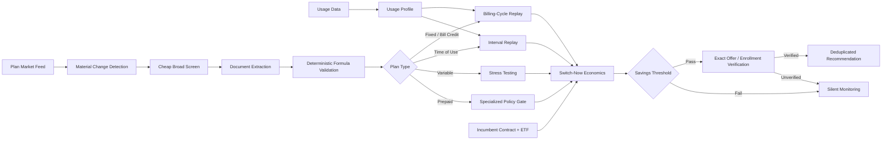

# Texas Electricity Plan Monitor

A portfolio-safe public edition of an autonomous Texas electricity-plan monitoring system.

The project continuously compares an incumbent retail electricity plan against the Texas retail market using real usage data, plan documents, deterministic pricing validation, time-of-use replay, risk-aware screening, and exact-offer enrollment verification.

> **Public-edition note**
>
> This repository intentionally excludes private credentials, service addresses, meter identifiers, live account data, provider-specific private artifacts, email destinations, and production state. The production system that inspired this repository uses the same architecture, but private integrations and personal data remain outside source control.

## What it does

- Ingests interval or billing-cycle electricity usage.
- Tracks a changing plan market and detects materially new/changed offers.
- Screens fixed, bill-credit, time-of-use, prepaid, and variable-rate plans differently.
- Validates extracted pricing formulas against published sample prices.
- Replays time-of-use plans against interval data instead of trusting provider-average load assumptions.
- Includes incumbent early-termination costs in switch-now economics.
- Stress-tests variable-rate plans before escalating them.
- Requires a configurable minimum net-savings threshold.
- Fails closed when a plan cannot be validated.
- Supports a final exact-offer enrollment gate before a recommendation is considered actionable.
- Suppresses duplicate recommendations.
- Runs unattended on a schedule and can emit opportunity, contract-expiration, and failure notifications.

## Why this exists

Retail electricity plans are difficult to compare correctly. Headline cents/kWh values can hide bill credits, base charges, transmission/distribution fees, time-of-use assumptions, prepaid conditions, variable-rate risk, early termination fees, and offers that are listed in one marketplace but difficult to locate on a provider's public catalog.

The system treats electricity-plan selection as a **data and decision-engineering problem**, not a simple price scrape.

## Architecture



A more detailed design is in [`docs/architecture.md`](docs/architecture.md).

## Safety philosophy

1. **Marketplace presence is not enough.**
2. **An extracted pricing formula is not enough.**
3. **A cheap advertised-rate estimate is not enough.**
4. **A recommendation is not actionable until the exact offer can be verified.**
5. **Failures remove a candidate from consideration rather than guessing.**
6. **The system recommends; it does not automatically change electricity providers.**

## Quick demo

The public edition runs in a self-contained demo mode using synthetic data.

```bash
python -m electricity_monitor.cli demo
```

## Production-style workflow

```text
usage update
→ market snapshot
→ change queue
→ fixed-plan validation
→ TOU ingestion/validation
→ prepaid policy evaluation
→ variable stress screen
→ incumbent contract check
→ comparison
→ exact-offer verification
→ deduplicated notification
```

## Repository layout

```text
src/electricity_monitor/
  models.py          Core data models
  pricing.py         Deterministic pricing functions
  comparison.py      Switch-now economics
  variable.py        Variable-rate stress scenarios
  enrollment.py      Fail-closed enrollment verification interface
  dedupe.py          Recommendation fingerprinting
  cli.py             Demo CLI

tests/               Unit tests
docs/                Architecture and public/private boundary
examples/            Synthetic inputs and output
.github/workflows/   CI
```

## Configuration

Copy `.env.example` to `.env`. The public demo requires no credentials.

A private deployment could supply integrations such as Smart Meter credentials, an LLM API key, email API key, and a private service-address file. Never commit these values.

## Decision policy represented in this public edition

- Minimum recommendation threshold: **$300 projected net savings**
- Variable plans: must survive a **+10% rate stress test** before escalation
- Time-of-use plans: use actual interval distribution when available
- Early termination fees: included in switch-now savings
- Enrollment verification: fail closed
- Duplicate recommendations: suppressed

All thresholds are configurable.

## Tests

```bash
python -m unittest discover -s tests -v
```

## Deploying privately

See [`docs/deployment.md`](docs/deployment.md).

## Privacy / security

See [`SECURITY.md`](SECURITY.md).

This repository contains **no real service address, meter identifier, API key, electricity account credential, billing history, or notification email address**.

## Status

The private system that inspired this repository reached end-to-end acceptance with scheduled unattended execution, deterministic validation, interval-aware TOU comparison, variable-rate stress testing, prepaid safety handling, contract-expiration monitoring, exact-offer enrollment verification, duplicate suppression, and email notifications.

This repository is a sanitized reference implementation and portfolio artifact rather than a byte-for-byte mirror of that private host.

## License

MIT
